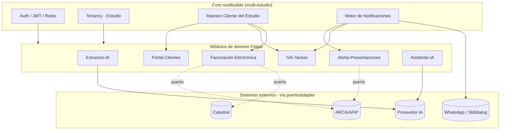

# CLAUDE.md — Nadia.Folgar.Plataforma.Backend

## Qué es esto
Backend de la plataforma operativa para el Estudio Contable Nadia Folgar (Buenos Aires),
construido por Novaptix bajo la metodología "Potencia Operativa" (ciclo de 6 meses,
2026-08-01 a 2027-01-31). Automatiza procesos hoy manuales (extractos bancarios,
vencimientos, facturación de honorarios) y expone la API que consume el Frontend.

## Repo hermano
Frontend en `C:\sources\Nadia.Folgar.Plataforma.Frontend`. Consume esta API vía el
spec de OpenAPI publicado en `/api/docs` (Swagger UI) y `/api/docs-json`. Ese spec es
el contrato formal — si el Frontend necesita algo que no existe acá, se documenta como
pendiente en su propio CLAUDE.md, nunca se inventa la forma de una respuesta.

## Arquitectura

## Mapa de módulos
| Módulo (backlog) | Tareas | Carpeta Backend | Estado |
|---|---|---|---|
| Fundación Técnica | 001–006 | auth/, roles/, users/, clientes/ | **Completo** — auth JWT+refresh, permisos granulares, maestro Cliente con paginación, seed inicial |
| Gestión de Proyecto / Mes 1 | 006, 078–081 | — (documentación) | No iniciado |
| Procesador de Extractos con IA | 007–012 | extractos-ia/ | No iniciado |
| Manual de Marca e Identidad Visual | 013–017 | — (diseño) | No iniciado |
| Sitio Web del Estudio | 018–022 | pendiente de decisión | No iniciado |
| Portal de Clientes | 023–027 | portal-clientes/ | No iniciado |
| Integración con Catedral | 028–032 | catedral/ | No iniciado |
| Motor de Notificaciones / Vencimientos | 033–039 | notificaciones/ | No iniciado |
| Alerta de Presentaciones | 040–045 | alerta-presentaciones/ | No iniciado — Riesgo Alto |
| Generación de Tareas IVA/ARBA/AGIP | 046–051 | iva-tareas/ | No iniciado |
| Factura Electrónica Automática | 052–058 | facturacion-electronica/ | No iniciado — Riesgo Alto |
| Asistente IA Institucional | 059–061 | asistente-ia/ | No iniciado |
| Bonos del Ciclo | 062–064 | — (facilitación) | No iniciado |
| QA General / Testing Integral | 065–068 | — (transversal) | No iniciado |
| Capacitación y Adopción | 069–072 | — | No iniciado |
| Despliegue e Infraestructura | 073–077 | docker-compose.yml, CI | No iniciado |

## Cómo correr el proyecto
- Requisitos: Node 20+ (probado con Node 22), Docker.
- `npm install`
- `cp .env.example .env` y completar `JWT_SECRET` / `JWT_REFRESH_SECRET` (mínimo 16 caracteres)
- `docker compose up -d mongo` (o `docker compose up -d` para levantar Mongo + API)
- `npm run start:dev` — API en `http://localhost:3000/api/v1`, Swagger en `/api/docs` y `/api/docs-json`
- `npm run seed` — crea el Estudio, los 3 roles de sistema y un usuario admin inicial
  (`admin@folgar.com.ar` / `CambiarEn1erLogin!` por defecto, override con `SEED_ADMIN_EMAIL`/`SEED_ADMIN_PASSWORD`)
- `npm run test` / `npm run test:e2e` / `npm run lint` / `npm run build`

Verificado end-to-end (build, lint, 11 tests unitarios, boot real contra Mongo en
Docker, login → `/auth/me` → alta y listado paginado de Cliente → error 400 con el
shape `{statusCode,message,error,timestamp,path}` → 401 sin token).

## Decisiones de arquitectura
1. **Mongoose, no Prisma** — el brief fija MongoDB/Mongoose explícitamente aunque
   QTech (fuente de reuso) usa Prisma/SQL Server. Se reutilizan los *patrones* de QTech
   (guards, permisos, DTOs, filtro de excepciones), reimplementados sobre Mongoose.
   Confirmado con Cristian el 2026-08-11.
2. **Fastify, no Express** — mejor performance y habilita Pino nativo.
3. **Permisos granulares por módulo** (`"clientes.read"`, no roles fijos) — mismo
   patrón que QTech (`@Permissions` + `PermissionsGuard` + `Reflector`), ya probado.
4. **Concepto de Estudio (tenant) desde el modelo de datos**, aunque hoy exista un
   solo registro. A diferencia del CRM de Novaptix (donde el filtro por `companyId`
   quedó fragmentado y aplicado a mano por cada controller), acá se resuelve con un
   guard/interceptor global o un plugin de Mongoose que inyecte el filtro automático.
5. **Puerto/adapter para toda integración externa** (Catedral, ARCA, WhatsApp, IA).
   Referencia: `src/modules/messaging/` del CRM de Novaptix (`MessagingProvider` como
   puerto, `Dialog360Provider` como adapter) — patrón ya probado, se reutiliza tal
   cual la idea. La integración de IA del CRM *no* sigue este patrón (acopla el SDK de
   OpenAI directo); en Folgar sí se aplica también ahí, corrigiendo ese punto.
6. **Logging con Pino** (`nestjs-pino`), no el logger custom de QTech — aprovecha la
   integración nativa de Fastify.
7. **Validación de env con Zod** — se reutiliza el patrón de `env.validation.ts` de
   QTech tal cual (ya es agnóstico de Prisma). Si falta una variable crítica, el
   bootstrap falla explícitamente, no arranca en silencio.
8. **Formato de error fijado por el brief**: `{ statusCode, message, error, timestamp,
   path }` — distinto del envelope `{ success, ... }` de QTech. Las respuestas
   exitosas no se envuelven (se mantienen como REST estándar), a diferencia de QTech.
9. **Riesgo Alto (Alerta-Presentaciones, Facturación-Electrónica)**: se construye el
   scaffold + contratos/puertos + UI; el adapter real contra ARCA/webservice de
   facturación queda stub hasta confirmar la vía de acceso con el cliente.

## Referencia al backlog
`docs/backlog/Folgar_Backlog_Tareas.json` (copiado desde el Frontend). 81 tareas,
16 módulos. Cada commit/PR referencia el ID de tarea que resuelve (ej. `FOLGAR-004`).

## Convenciones
- Un módulo de NestJS por dominio del backlog: `controller` + `service` + `dto/` +
  `schema/` + `*.spec.ts`. Nada de lógica cross-dominio en un controller ajeno.
- DTOs con `class-validator`; `ValidationPipe` global (whitelist, forbidNonWhitelisted, transform).
- Paginación estándar: DTO de query `page/limit/+filtro`, respuesta `{ data, total, page, limit }`.
- Testing: Jest + ts-jest + supertest. Unit tests para lógica no trivial (motor de
  reglas, bloqueo por impagos, generación mensual). Al menos 1 test e2e por módulo.
- ESLint + Prettier + Conventional Commits (`feat:`, `fix:`, `docs:`, `refactor:`, `test:`, `chore:`).
- Prefijo de API: `/api/v1`. Swagger en `/api/docs` y `/api/docs-json`.
- Seguridad: helmet, `@nestjs/throttler` en endpoints públicos, CORS explícito,
  secrets solo por variable de entorno.

## Pendiente de sincronizar con el Frontend
- Ninguno todavía — este es el commit fundacional de ambos repos.
